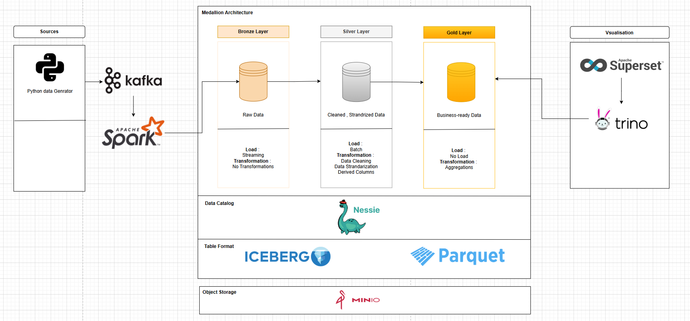

### General Architecture

This repository demonstrates a Medallion-style data lakehouse using Apache Iceberg, Apache Spark, Kafka, MinIO (S3-compatible storage), and Trino. It includes a simple Python producer, Spark jobs for bronze/silver/gold processing, and configuration files to run Trino against Iceberg.

### General Architecture



┌─────────────────────────────────────────────────────────────────────────────┐
│                              MEDALLION LAKEHOUSE                             │
├─────────────────────────────────────────────────────────────────────────────┤
│                                                                              │
│  ┌──────────┐     ┌───────┐     ┌─────────────────────────────────────────┐ │
│  │ Python   │────▶│ Kafka │────▶│            Apache Spark                 │ │
│  │ Producer │     └───────┘     │  (Streaming & Batch Processing)         │ │
│  └──────────┘                   └──────────────┬──────────────────────────┘ │
│                                                │                             │
│                                                ▼                             │
│                    ┌──────────────────────────────────────────────┐         │
│                    │           Apache Iceberg                      │         │
│                    │    (Table Format + ACID Transactions)         │         │
│                    │                                               │         │
│                    │  ┌─────────────────────────────────────────┐ │         │
│                    │  │           Nessie Catalog                 │ │         │
│                    │  │  (Git-like versioning for tables)        │ │         │
│                    │  └─────────────────────────────────────────┘ │         │
│                    └─────────────────────────────────────────────────────┘         │
│                                                │                             │
│            ┌───────────────────────────────────┼───────────────────┐        │
│            ▼                                   ▼                   ▼        │
│   ┌─────────────────┐            ┌─────────────────┐    ┌─────────────────┐ │
│   │  Bronze Bucket  │            │  Silver Bucket  │    │  Gold Bucket    │ │
│   │    (MinIO)      │───────────▶│    (MinIO)      │───▶│   (MinIO)       │ │
│   │   Raw Data      │   Spark    │ Cleaned Data    │    │ Aggregations    │ │
│   └─────────────────┘            └─────────────────┘    └────────┬────────┘ │
│                                                                   │         │
│                                                                   ▼         │
│                                                          ┌────────────────┐ │
│                                                          │     Trino      │ │
│                                                          │  (SQL Engine)  │ │
│                                                          └───────┬────────┘ │
│                                                                  │          │
│                                                                  ▼          │
│                                                          ┌────────────────┐ │
│                                                          │   Superset     │ │
│                                                          │ (Dashboards)   │ │
│                                                          └────────────────┘ │
└─────────────────────────────────────────────────────────────────────────────┘

---

## Quickstart

- Prerequisites: `docker`, `docker-compose`, and Python 3.8+ (for local runs).
- Start the stack (containers include MinIO, Kafka, Trino, Spark components as configured):

```bash
docker-compose up -d
```

- Inspect Trino configs in `trino/` and sample queries in `trino/sample_queries.sql`.

## Components

- **Producer**: lightweight Python Kafka producer located at `producer/census_producer.py` (see `producer/requirements.txt`).
- **Spark jobs**: batch/streaming jobs in `spark-jobs/`:
	- `bronze_ingestion.py` — ingests raw records into bronze Iceberg tables
	- `silver_processing.py` — cleaning/standardization
	- `gold_aggregations.py` — business-level aggregates
	- `medallion_pipeline.py` — orchestration example
- **Storage**: MinIO buckets used to simulate Bronze/Silver/Gold object stores.
- **Catalog & SQL**: Iceberg + Nessie (when configured) with Trino as the query engine.

## Run the producer (local example)

Install dependencies and run the producer to push sample data to Kafka:

```bash
pip install -r producer/requirements.txt
python producer/census_producer.py
```

## Run Spark jobs

Spark jobs are in `spark-jobs/`. You can submit them to the Spark cluster/container configured in this repo or run locally for testing. Example submission (adjust to your Spark setup):

```bash
# Example: dockerized spark-submit or your cluster's submit command
# spark-submit --master local[4] spark-jobs/bronze_ingestion.py
```

## Files & Layout

- `docker-compose.yaml` — service orchestration for local demos
- `producer/` — Kafka producer code and Dockerfile
- `spark/`, `spark-jobs/` — Spark image and job sources
- `trino/` — Trino configuration and sample queries

## Notes

- This repository is intended as a learning/demo environment. Adjust resource limits and configuration before using in production.

## Contributing

PRs and issues welcome — please add runnable reproduction steps for bugs.

---


